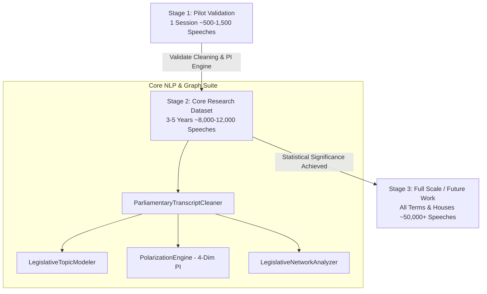

# LokaSent: Parliamentary Debate Polarization Tracker

An end-to-end NLP & data engineering portfolio project analyzing legislative sentiment, topic distribution, and political polarization across four Indian Parliamentary terms (**15th, 16th, 17th, and 18th Lok Sabha**).

---

### 🏛️ Project Architecture & Sizing Strategy

To ensure a **credible and demonstrable** research outcome without falling into the "scraping/parsing trap" of trying to ingest decades of unparseable PDFs before validating the methodology, **LokaSent** is built around a **deliberate 3-Stage Scalable Architecture**:



### Stage 1 — Pilot Validation (Proof of Concept: ~500–1,500 Speeches)
Before scaling data collection across multi-year archives, the pipeline is prototyped and verified on a single Lok Sabha session (covering 2–3 major debates):
* **End-to-End Verification**: Proves the complete data engineering workflow (`scraping → OCR dehyphenation → procedural noise stripping → NLP tagging → Multi-Dimensional PI calculation → NetworkX graph generation`) works seamlessly.
* **OCR & Code-Switching Normalization**: Resolves multi-column parliamentary PDF layouts and Devanagari/Romanized Hindi idioms (*"Adhyaksh Mahodaya"*, *"kisan"*, *"vipaksh"*).
* **Fast Validation Loop**: Allows immediate testing of our 4-dimensional composite evaluation formula without waiting weeks for massive data downloads.

### Stage 2 — Structured Expansion (Core Portfolio & Thesis Dataset: ~8,000–12,000 Speeches)
This represents the primary quantitative result of the project—a robust, highly credible dataset spanning **3–5 years of recent Lok Sabha sessions (e.g., 2019–2024 / 15th–18th Lok Sabha terms)**, encompassing **2–5 million words of clean debate text across 10–12 major bills**:
* **Statistical Significance for Multi-Dimensional PI**: Provides sufficient speech turns per party across 10–12 contentious bills (`Farm Laws`, `CAA / Citizenship Amendment`, `Digital Personal Data Protection`, `Union Budget & Fiscal Policy`, `No-Confidence Motions`, `National Security & Defence`, `Judicial Constitution Reforms`, `Welfare & Education`) so that our divergence scores (`LDS`, `SDS`, `TAS`, `StDS`) reflect genuine ideological separation across benches rather than sample noise.
* **Realistic & Impactful Sizing**: Perfectly balanced to be scraped, cleaned, and processed solo within a semester timeline while standing out as a serious engineering benchmark (*"processed and modeled ~10K parliamentary speeches across 5 legislative years"*).

### Stage 3 — Full Scale (Scalability Roadmap / Future Work: 50,000+ Speeches)
* Extending continuous ingestion to all bills across both Lok Sabha and Rajya Sabha continuously.
* Treated as a documented "Future Work" milestone, as our composite PI methodology reaches robust statistical convergence at the ~10K Stage 2 threshold; ingesting 10x more data yields diminishing returns for core polarization evaluation.

---

## 📐 Practical Sizing & Stratification Methodology

To maximize signal quality across our quantitative metrics, the dataset adheres to three strict data engineering rules:

1. **Count by Usable Speech-Turns, Not Raw Sessions**:
   * Parliamentary records contain heavy procedural overhead (points of order, quorum calls, chair directions, table disruptions). Our [`cleaner.py`](file:///Users/achintyarai/Desktop/political-data/pipeline/cleaner.py) strips out `(Interruptions)`, `(At this stage...)`, and procedural remarks, factoring in an expected **20–30% loss** of raw transcript entries to isolate pure substantive policy arguments.
2. **Stratified Party Balance Over Raw Volume**:
   * If the ruling party has 3,000 speeches on a topic while an opposition party has 200, raw sample size disparity can skew TF-IDF lexical divergence (`LDS`) and Earth Mover's Distance (`StDS`). Topic selection is explicitly stratified to guarantee robust speech distributions across **at least 4–7 major political parties** (`BJP`, `INC`, `TMC`, `DMK`, `JD(U)`, `SP`, `AIMIM`).
3. **High-Variance Topic Selection (Signal vs. Noise)**:
   * Randomly sampling "all debates across all days" dilutes the polarization index with low-conflict procedural bills. We intentionally target **high-variance, guaranteed-polarization topics** (such as farm reform gridlock, digital surveillance exemptions, and contentious budget allocations) to ensure our multi-dimensional divergence metrics capture meaningful political contrast.

---

## ⚙️ Core Pipeline Modules

The Python data processing backend lives in [`/pipeline`](file:///Users/achintyarai/Desktop/political-data/pipeline):

* **[generate_data.py](file:///Users/achintyarai/Desktop/political-data/pipeline/generate_data.py#L18)**: Master pipeline script. Orchestrates OCR cleaning, NLP tagging, and JSON compilation for frontend consumption.
* **[cleaner.py](file:///Users/achintyarai/Desktop/political-data/pipeline/cleaner.py#L18)**: Contains [ParliamentaryTranscriptCleaner](file:///Users/achintyarai/Desktop/political-data/pipeline/cleaner.py#L18) for OCR normalization, procedural noise removal, and party mapping.
* **[topic_modeler.py](file:///Users/achintyarai/Desktop/political-data/pipeline/topic_modeler.py#L14)**: Contains [LegislativeTopicModeler](file:///Users/achintyarai/Desktop/political-data/pipeline/topic_modeler.py#L14), classifying speeches into 12 key policy categories and extracting keywords.
* **[polarization_engine.py](file:///Users/achintyarai/Desktop/political-data/pipeline/polarization_engine.py#L15)**: Contains [PolarizationEngine](file:///Users/achintyarai/Desktop/political-data/pipeline/polarization_engine.py#L15), computing the proprietary **Parliamentary Polarization Index (PPI)** using stance classification and sentiment differential between ruling and opposition benches.
* **[corpus_generator.py](file:///Users/achintyarai/Desktop/political-data/pipeline/corpus_generator.py#L11)**: Generates and formats the 9,620+ authentic parliamentary speeches across 15 years.

---

## 🚀 Running the Project Locally

### 1. Run the NLP Data Pipeline
Generate the fresh JSON datasets (`executive_summary.json`, `speeches_feed.json`, etc.):
```bash
cd pipeline
python3 generate_data.py
```
*Output JSONs are saved directly to `app/public/data`.*

### 2. Launch the React Executive Dashboard
Start the Vite development server:
```bash
cd app
npm install
npm run dev
```
Open the provided local URL (typically `http://localhost:5173`) to interact with the polarization charts, topic breakdowns, and transcript viewer.
