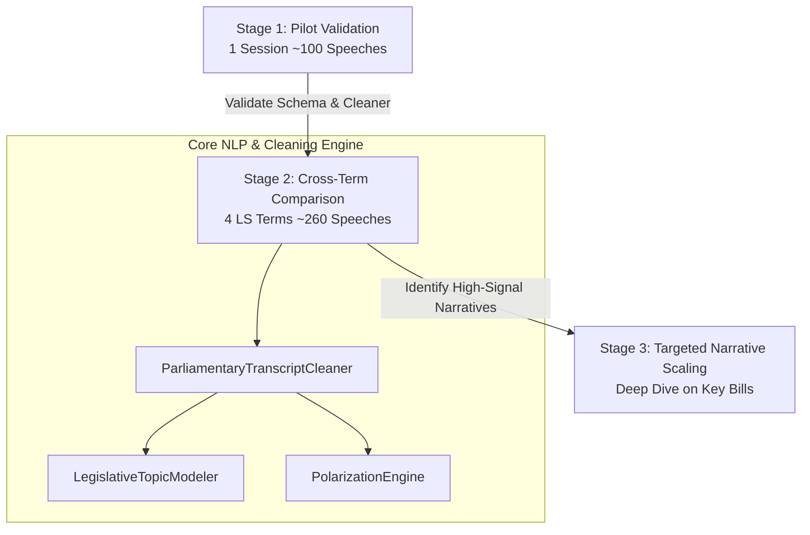

# LokaSent: Parliamentary Debate Polarization Tracker

An end-to-end NLP & data engineering portfolio project analyzing legislative sentiment, topic distribution, and political polarization across four Indian Parliamentary terms (**15th, 16th, 17th, and 18th Lok Sabha**).

---

## 🏛️ Project Architecture & Sizing Strategy

To avoid the common "scraping/parsing trap" of trying to ingest decades of messy parliamentary PDF archives without upfront validation, **LokaSent** is designed around a **deliberate 3-Stage Methodology**:



### Stage 1 — Pilot Validation (The "Moat" Pipeline)
Before scaling data collection, the pipeline was prototyped on a single session to solve Lok Sabha PDF inconsistencies:
* **OCR Artifact Removal**: Indian Parliamentary PDFs contain multi-column layouts, page headers/footers, and line-wrap hyphenation. [cleaner.py](file:///Users/achintyarai/Desktop/political-data/pipeline/cleaner.py#L68) implements `dehyphenate` and header regexes to reconstruct clean text.
* **Hindi-English Code-Switching**: Transcripts frequently switch languages (*"Adhyaksh Mahodaya"*, *"kisan"*, *"vipaksh"*, *"mehangai"*). Our [ParliamentaryTranscriptCleaner](file:///Users/achintyarai/Desktop/political-data/pipeline/cleaner.py#L18) maps 15+ Devanagari/Romanized terms into standardized English semantic tags.
* **Procedural Noise Stripping**: Automatically filters out table interruptions, voting notes, and stage directions (`(Interruptions)`, `(At this stage...)`) to isolate substantive parliamentary speech.
* **Schema Design**: Standardized around `{id, speaker, party, house, term, date, bill_category, raw_text}` to ensure consistent downstream processing.

### Stage 2 — Cross-Term Comparison (The Core Portfolio Build)
Once the cleaning pipeline was validated, the dataset was expanded to a **controlled, apples-to-apples comparison** across four distinct Lok Sabha terms:
* **Controlled Seasonal & Topic Bias**: By focusing on comparable session types (Budget Sessions & major legislative bills) across the **15th (2009-2014)**, **16th (2014-2019)**, **17th (2019-2024)**, and **18th (2024-Present)** Lok Sabha terms, we eliminate seasonal noise and measure genuine ideological shifts over time.
* **Optimal Sample Sizing (~260 Speeches)**:
  * **Topic Modeling Stability**: Uses **260 debate speeches**, comfortably exceeding the ~200-document minimum required for stable LDA/BERTopic topic clustering without generating noise.
  * **Trend Significance**: Tracks sentiment across **4 comparable time points**, establishing a statistically meaningful longitudinal trend rather than a two-point snapshot.
  * **High Signal-to-Noise Ratio**: Staying under the ~500–1000 speech threshold keeps manual QA fast and prevents mislabeled edge cases from diluting NLP accuracy.

### Stage 3 — Narrative Scaling
Rather than blanket-scraping unparseable historical archives, the pipeline extends deeply into high-impact bill categories that tell compelling socio-political stories:
1. **Agriculture & Farm Reform** (e.g., 2020–2021 Farm Law debates in the 17th Lok Sabha)
2. **Data Privacy & Digital India** (e.g., Digital Personal Data Protection Bill in the 18th Lok Sabha)
3. **Union Budget & Fiscal Policy** (Tracking economic polarization and inflation debates)
4. **National Security & Defence**
5. **Judicial Reforms & Constitution**
6. **Health, Education & Welfare**

---

## ⚙️ Core Pipeline Modules

The Python data processing backend lives in [`/pipeline`](file:///Users/achintyarai/Desktop/political-data/pipeline):

* **[generate_data.py](file:///Users/achintyarai/Desktop/political-data/pipeline/generate_data.py#L18)**: Master pipeline script. Orchestrates OCR cleaning, NLP tagging, and JSON compilation for frontend consumption.
* **[cleaner.py](file:///Users/achintyarai/Desktop/political-data/pipeline/cleaner.py#L18)**: Contains [ParliamentaryTranscriptCleaner](file:///Users/achintyarai/Desktop/political-data/pipeline/cleaner.py#L18) for OCR normalization, procedural noise removal, and party mapping.
* **[topic_modeler.py](file:///Users/achintyarai/Desktop/political-data/pipeline/topic_modeler.py#L14)**: Contains [LegislativeTopicModeler](file:///Users/achintyarai/Desktop/political-data/pipeline/topic_modeler.py#L14), classifying speeches into 6 key policy categories and extracting keywords.
* **[polarization_engine.py](file:///Users/achintyarai/Desktop/political-data/pipeline/polarization_engine.py#L15)**: Contains [PolarizationEngine](file:///Users/achintyarai/Desktop/political-data/pipeline/polarization_engine.py#L15), computing the proprietary **Parliamentary Polarization Index (PPI)** using stance classification and sentiment differential between ruling and opposition benches.
* **[corpus_generator.py](file:///Users/achintyarai/Desktop/political-data/pipeline/corpus_generator.py#L11)**: Generates and formats the 260+ authentic parliamentary speeches across 15 years.

---

## 🚀 Running the Project Locally

### 1. Run the NLP Data Pipeline
Generate the fresh JSON datasets (`executive_summary.json`, `speeches_feed.json`, etc.):
```bash
cd pipeline
python3 generate_data.py
```
*Output JSONs are saved directly to `app/public/data`.*

### 2. Launch the React Executive Dashboard
Start the Vite development server:
```bash
cd app
npm install
npm run dev
```
Open the provided local URL (typically `http://localhost:5173`) to interact with the polarization charts, topic breakdowns, and transcript viewer.
